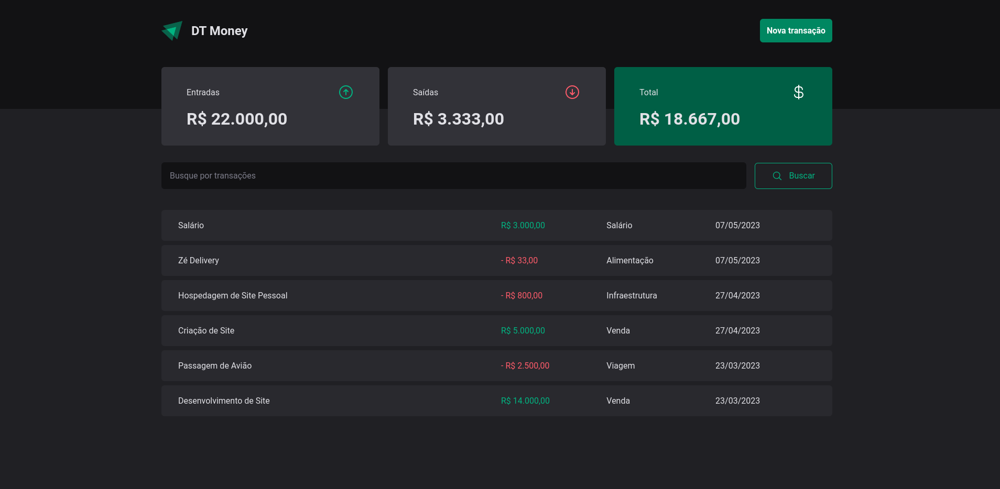

# DT Money

Plataforma de controle de finanças pessoais, onde permite inserir transações de crédito e débito, categorizar, datar e buscar. A plataforma nos apresenta de forma simplificada um dashboard com as principais informações: Entradas, Saídas e Saldo.  
Através do desafio foi possível aplicar os principais conceitos:
- Criação de projeto React utilizando o Vite.
- Criação e Consumo de API Local/Mock com JSON-Server e Axios.
- Utilização de Context API.
- Criação de hook personalizado.
- Utilização dos principais hooks do React.
- Criação de Componentes.
- Estilização com Styled Components.

### Layout
[Figma](<https://www.figma.com/file/XmDrRWvc44jYJICRhRVvSw/DT-Money-(Community)?node-id=0-1&t=XfYoVWN1aVycGmQK-0>)

### Libs Utilizadas:

[Styled Components](https://styled-components.com/)  
[Radix-Ui](https://www.radix-ui.com/)  
[JSON Server](https://www.npmjs.com/package/json-server)  
[React Hook Form](https://react-hook-form.com)  
[React Hook Form Resolvers](https://react-hook-form.com/api/useform/#resolver)  
[Zod](https://zod.dev/)  
[Axios](https://axios-http.com/ptbr/docs/intro)

### Instruções para Iniciar:

1. Instalar as dependências com `npm install`.
2. Utilizar `npm run dev:server` para inciar o servidor local e executar o projeto.
3. Utilizar `npm run dev` para iniciar o projeto.

### Evidências:

  

  

